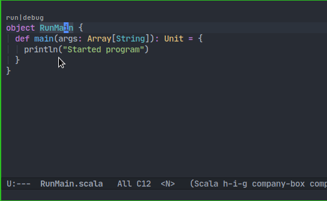
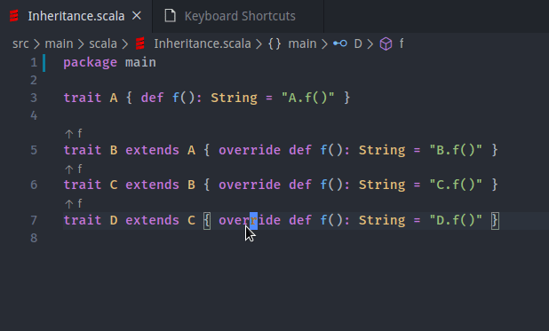
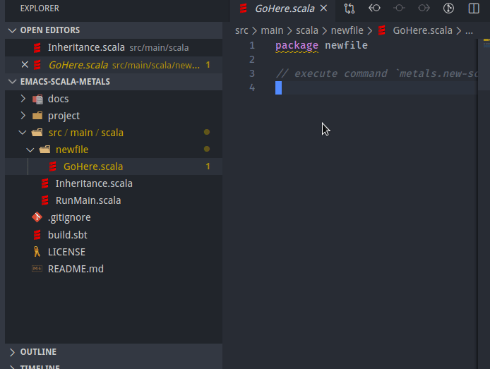

# emacs-scala-metals
Emacs scala metals setup project

## Running program from within emacs

## Jumping to super method in hierarchy
Used command: `metals.super-method-hierarchy`
How it looks like in vscode:

## Creating new file from template
Used command: `metals.new-scala-file`
How it looks like in vscode:

